# YouTube Competition Analysis System

A competitive intelligence platform that tracks YouTube competitors and identifies trending video topics.

---

## Quick Summary

**What it does:** Monitors competitor YouTube channels, measures video performance relative to each channel's baseline, and uses AI to detect trending topics across your niche.

**Key insight:** A video with 10K views on a 5K-median channel (2x performance) is more valuable than 50K views on a 100K-median channel (0.5x). **Relative performance matters.**

---

## System Architecture


---

## The Four Parts

| Part | Status | Purpose |
|------|--------|---------|
| **Part 1: Tracking** | ✅ Complete | Monitor videos, capture snapshots, calculate baselines |
| **Part 2: Trends** | ✅ Complete | AI-powered topic extraction and clustering |
| **Part 3: Discovery** | 🔄 In Progress | Find new competitors via trending keywords |
| **Part 4: HITs** | ⏳ Planned | Detect breakout videos algorithmically |

---

## Part 1: Video Tracking & Baselines

### How Video Tracking Works


### Snapshot Windows

Each video gets captured at 8 time points:

| Window | Purpose |
|--------|---------|
| T+0 | Immediate baseline |
| T+1h | Early velocity |
| T+6h | Short-term performance |
| T+12h | Half-day check |
| **T+24h** | **Primary metric** (most stable) |
| T+48h | Extended performance |
| T+7d | Week performance |
| T+14d | Final snapshot, video marked complete |

### Baseline Calculation


**Why median?**
- Mean is skewed by viral outliers
- Median = "typical" video performance
- A video at 2x median is genuinely above average

### Performance Ratio

```
performance_ratio = video_views_24h / channel_median_views_24h
```

| Ratio | Meaning |
|-------|---------|
| 0.5x | Below average (half of typical) |
| 1.0x | Average (typical performance) |
| **1.5x+** | Above average (qualifies for trend detection) |
| 3.0x+ | Potential HIT |

---

## Part 2: Trend Detection

### Overview

Runs daily at 2 AM UTC. Identifies topics that multiple channels in your bucket are covering successfully.

```mermaid
flowchart TB
    subgraph Input
        V[Videos from last 14 days<br>with ≥1.5x performance]
    end

    subgraph Step1["Step 1: Extract Topics"]
        T[Fetch transcript]
        AI1[AI extracts 1-3 topics<br>per video]
        T --> AI1
    end

    subgraph Step2["Step 2: Cluster Topics"]
        AI2[AI groups similar topics]
        AI2 --> C1["chatgpt tutorials"]
        AI2 --> C2["midjourney tips"]
        AI2 --> C3["ai video editing"]
    end

    subgraph Step3["Step 3: Qualify Trends"]
        Q{2+ channels<br>in cluster?}
        Q -->|Yes| TREND[Save as TREND]
        Q -->|No| SKIP[Skip]
    end

    V --> Step1
    Step1 --> Step2
    Step2 --> Step3
```



### Topic Extraction

**Input:** Video title + transcript (or description fallback)

**AI Prompt Rules:**
- Be SPECIFIC, not generic ("chatgpt prompt engineering" not "AI")
- 2-5 words per topic
- Lowercase
- 1-3 topics per video

**Example:**
```
Video: "How I Use ChatGPT to Write YouTube Scripts in 5 Minutes"

Extracted topics:
- chatgpt youtube scripts
- ai content creation
```

### Topic Clustering

Groups similar raw topics into normalized clusters:

```
Raw topics:
- "chatgpt tips"
- "chatgpt tutorial"
- "chatgpt for beginners"
- "using chatgpt"

Cluster: "chatgpt tutorials"
```

### Trend Qualification

A cluster becomes a **TREND** when:
1. **2+ unique channels** are covering it
2. Videos are from **last 14 days**
3. All videos have **≥1.5x performance**

### Trend Metrics

| Metric | Description |
|--------|-------------|
| `channel_count` | Number of competitors covering this topic |
| `video_count` | Total videos about this topic |
| `avg_performance` | Average performance ratio (e.g., 2.3x) |

---

## Part 3: Channel Discovery

### Purpose

Find new competitor channels by searching YouTube using your trending topics as keywords.

```mermaid
flowchart TB
    subgraph Keywords
        TR[Trending Topics<br>ordered by channel_count]
    end

    subgraph Search
        YT[YouTube Search API<br>type=channel]
    end

    subgraph Filter["Apply Filters"]
        F1[Subscriber range]
        F2[Video count minimum]
        F3[Channel age]
        F4[Not kids content]
        F5[Country filter]
        F6[Recently active]
    end

    subgraph Output
        SUG[Channel Suggestions]
        ACC[Accept → Add to bucket]
        DEC[Decline → Won't suggest again]
    end

    TR --> YT
    YT --> Filter
    Filter --> SUG
    SUG --> ACC
    SUG --> DEC
```



### Discovery Filters

| Filter | Description | Default |
|--------|-------------|---------|
| `min_subscribers` | Minimum subscriber count | 1,000 |
| `max_subscribers` | Maximum subscriber count | 10,000,000 |
| `min_videos` | Minimum video count | 10 |
| `min_channel_age_days` | Minimum channel age | 90 |
| `exclude_kids_content` | Skip "made for kids" channels | true |
| `country_filter` | Only specific countries | [] (any) |
| `activity_check` | Check recent uploads | true |
| `max_days_since_upload` | Max days since last video | 30 |

### Hard Filters (Always Applied)

- Not already tracked
- Not already suggested
- Subscriber count visible (not hidden)

---

## Part 4: HIT Detection (Planned)

### What is a HIT?

A **HIT** is a breakout video that significantly outperforms the channel's baseline.

### Planned Criteria

- Performance ratio ≥ 3x baseline
- Early velocity indicators (1h/6h spikes)
- Cross-channel validation (topic trending elsewhere)

---

## Database Schema


---

## Tech Stack

| Component | Technology | Hosting |
|-----------|------------|---------|
| Backend | Python + FastAPI | Railway |
| Database | PostgreSQL | Supabase |
| Frontend | Next.js + TypeScript | Vercel |
| AI/LLM | DeepSeek via OpenRouter | - |
| Video Discovery | YouTube WebSub | Google PubSubHubbub |
| Video Stats | YouTube Data API v3 | - |

---

## Configuration

### Environment Variables

```bash
# Database
SUPABASE_URL=https://xxx.supabase.co
SUPABASE_KEY=eyJ...

# YouTube
YOUTUBE_API_KEY=AIza...

# AI
OPENROUTER_API_KEY=sk-or-...
OPENROUTER_MODEL=deepseek/deepseek-chat

# Discovery Mode
DISCOVERY_MODE=websub  # or "polling" for local dev
WEBSUB_CALLBACK_URL=https://your-app.up.railway.app/webhooks/youtube
```

### Trend Detection Settings

| Setting | Default | Description |
|---------|---------|-------------|
| `TREND_WINDOW_DAYS` | 14 | Look-back period |
| `TREND_MIN_PERFORMANCE` | 1.5 | Min performance ratio |
| `TREND_MIN_CHANNELS` | 2 | Min channels for trend |

---

## API Endpoints

### Core
| Method | Endpoint | Description |
|--------|----------|-------------|
| GET | `/` | Health check |
| GET | `/health` | Railway health |

### Trends
| Method | Endpoint | Description |
|--------|----------|-------------|
| POST | `/run-trends` | Trigger trend detection |
| GET | `/trends` | Get current trends |

### Discovery
| Method | Endpoint | Description |
|--------|----------|-------------|
| POST | `/discover-channels/{bucket_id}` | Run discovery |
| GET | `/discovery/settings/{bucket_id}` | Get settings |
| PUT | `/discovery/settings/{bucket_id}` | Update settings |
| GET | `/discovery/keywords/{bucket_id}` | Get keywords |
| GET | `/suggestions/{bucket_id}` | Get suggestions |
| POST | `/suggestions/{id}/accept` | Accept suggestion |
| POST | `/suggestions/{id}/decline` | Decline suggestion |

### WebSub
| Method | Endpoint | Description |
|--------|----------|-------------|
| GET | `/webhooks/youtube` | WebSub verification |
| POST | `/webhooks/youtube` | WebSub notifications |

---

## Background Jobs

| Job | Interval | Description |
|-----|----------|-------------|
| Discovery | 15-60 min | Check for new videos |
| Snapshot Worker | 5 min | Process pending snapshots |
| Baseline Calculator | 12 hours | Recalculate channel baselines |
| Completion Check | 1 hour | Mark completed videos |
| WebSub Renewal | 24 hours | Renew subscriptions |
| Trend Detection | Daily 2 AM | Run trend detection |

---

## Key Formulas

### Performance Ratio
```
performance = views_24h / channel_median_24h
```

### Trend Threshold
```python
min_channels = max(2, min(TREND_MIN_CHANNELS, bucket_size // 2))
```

### Baseline (Median)
```python
median_views = sorted(last_30_videos)[len // 2]
```

---

## File Structure

```
youtube-competition-analysis/
├── src/
│   ├── config.py              # Configuration
│   ├── database/              # Supabase operations
│   │   ├── channels.py
│   │   ├── videos.py
│   │   ├── snapshots.py
│   │   ├── baselines.py
│   │   ├── topics.py
│   │   └── discovery.py
│   ├── youtube/               # YouTube API
│   │   ├── api.py
│   │   └── shorts_detector.py
│   ├── discovery/             # Video & Channel discovery
│   │   ├── polling.py
│   │   ├── websub.py
│   │   └── channel_discovery.py
│   ├── trends/                # Trend detection
│   │   ├── transcript.py
│   │   ├── extractor.py
│   │   ├── clustering.py
│   │   └── detector.py
│   └── scheduler/
│       └── snapshot_worker.py
├── dashboard/                 # Next.js frontend
│   ├── src/
│   │   ├── app/
│   │   ├── components/
│   │   └── lib/
│   └── package.json
├── main.py                    # Entry point
├── requirements.txt
└── ROADMAP.md
```

---

## Quick Start

### 1. Run Backend Locally
```bash
# Install dependencies
pip install -r requirements.txt

# Set environment variables
export SUPABASE_URL=...
export YOUTUBE_API_KEY=...
export DISCOVERY_MODE=polling

# Run
python main.py
```

### 2. Run Dashboard Locally
```bash
cd dashboard
npm install
npm run dev
```

### 3. Add a Channel
```bash
python main.py --add-channel
# Enter YouTube URL when prompted
```

### 4. Trigger Trend Detection
```bash
curl -X POST http://localhost:8080/run-trends
```

---

## Glossary

| Term | Definition |
|------|------------|
| **Baseline** | Channel's typical (median) performance |
| **Performance Ratio** | Video views ÷ channel baseline |
| **Bucket** | User-defined group of channels |
| **Topic** | Specific subject extracted from video (AI) |
| **Cluster** | Group of similar topics |
| **Trend** | Topic covered by 2+ channels successfully |
| **HIT** | Breakout video (≥3x baseline) |
| **WebSub** | Real-time YouTube notifications |
| **Snapshot** | Video stats captured at a point in time |
